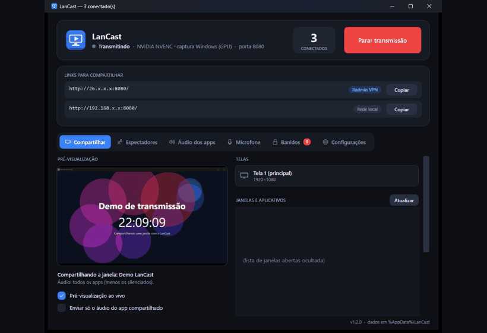
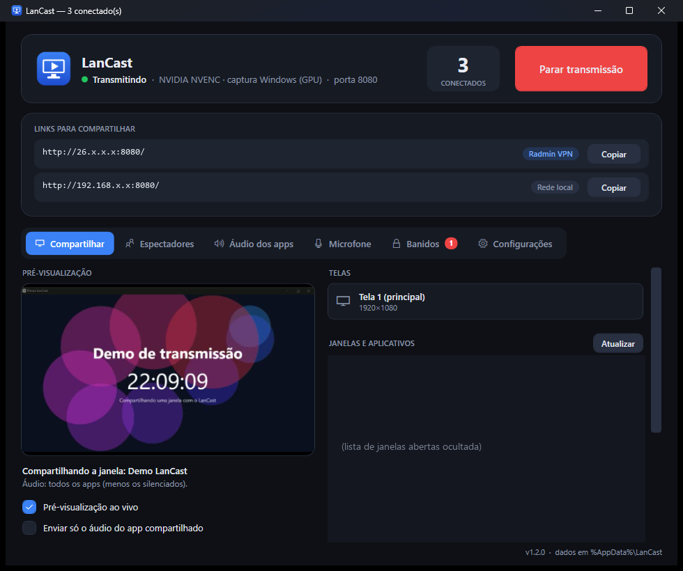
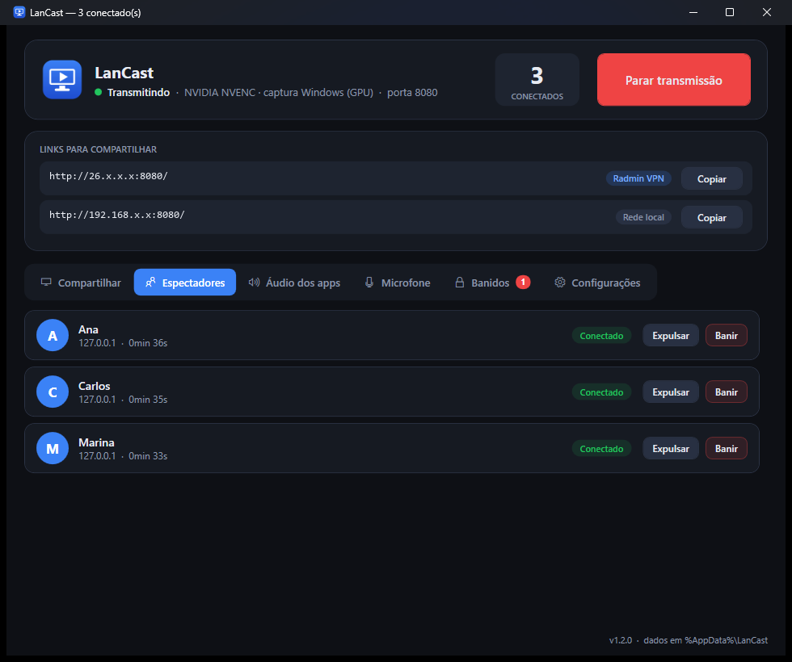
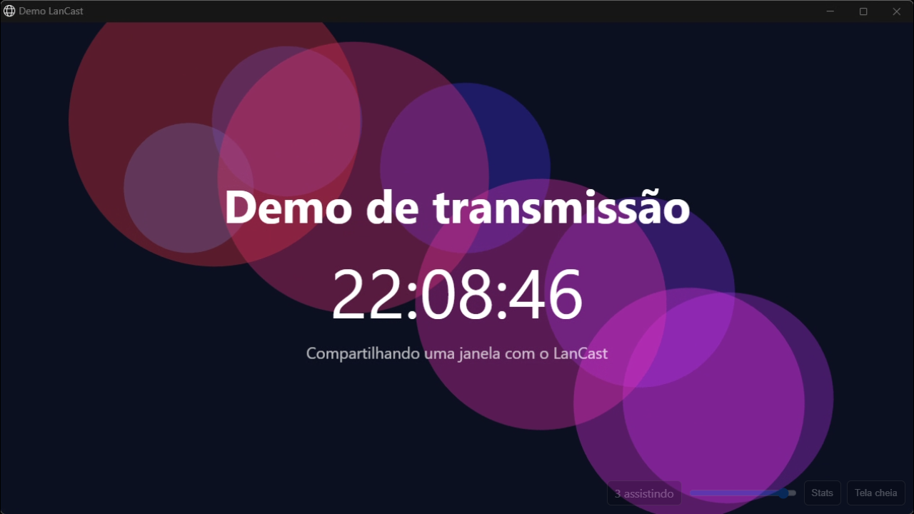
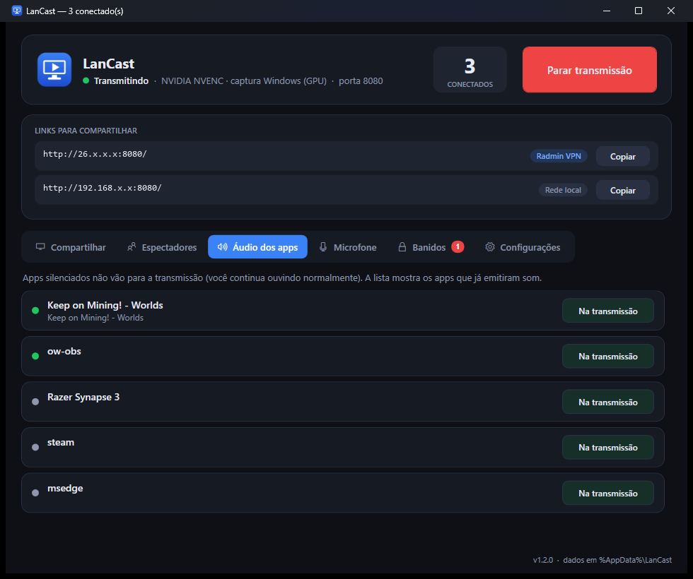
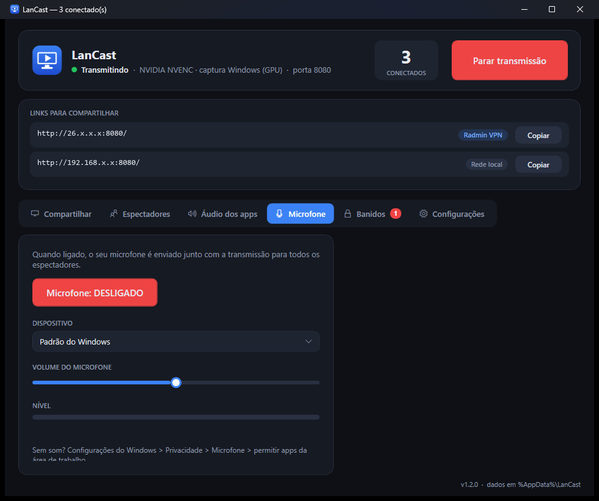
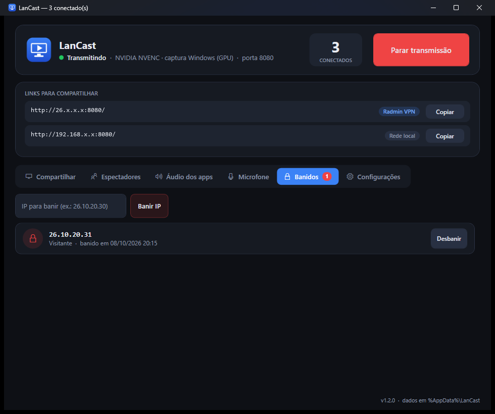
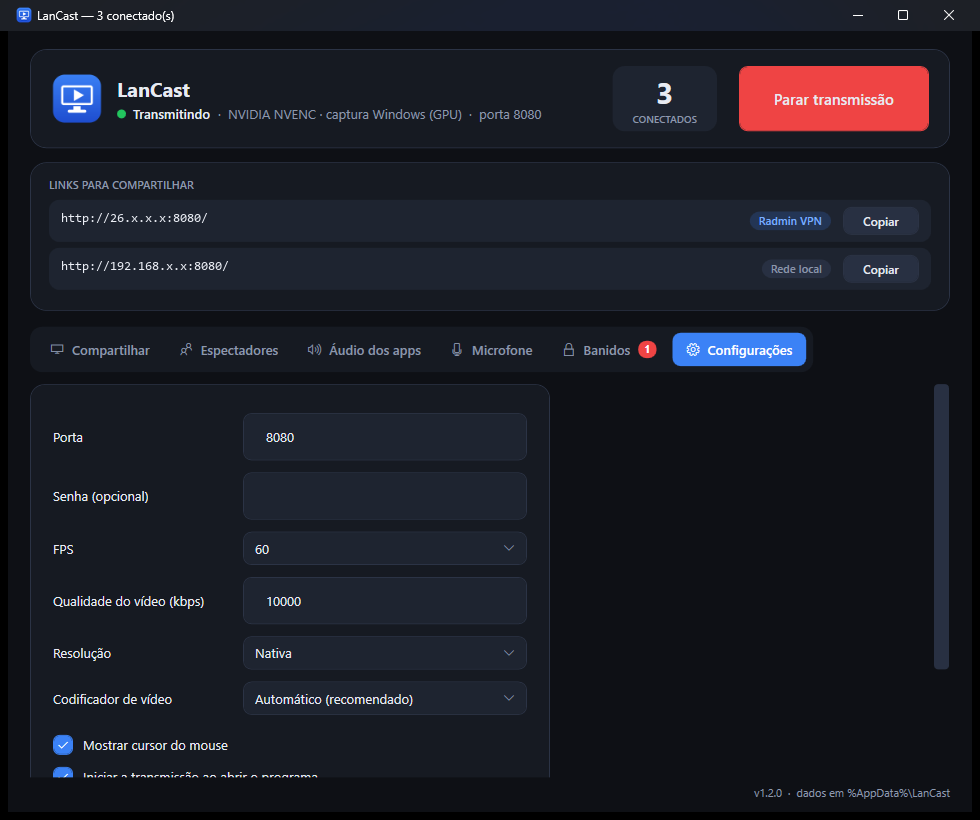

# LanCast

Compartilhamento de tela **local, de baixa latência**, pensado para jogar/assistir junto com amigos por VPN (Radmin).
Você transmite sua tela (ou só uma janela) e quem assiste abre um link no navegador. Sem conta, sem instalar nada do lado de quem assiste.



- **Vídeo:** H.264 por GPU (NVIDIA NVENC, com fallback para AMD, Intel e software) até 60 FPS.
- **Áudio:** Opus de 10 ms, com mixagem por aplicativo e microfone opcional.
- **Transporte:** WebRTC direto entre você e cada espectador (nenhum servidor na nuvem).
- **Quem assiste:** só precisa do Chrome ou Edge.

## Download

Baixe na página de [**Releases**](https://github.com/Guma325/LanCast/releases/latest):

| Modo | Arquivo | Para quê |
|---|---|---|
| **Instalador** | `LanCast-Setup-x.y.z.exe` | Instala em Arquivos de Programas, cria atalhos (Menu Iniciar / Área de Trabalho), libera o Firewall e adiciona desinstalador. |
| **Portátil** | `LanCast-Portable-x.y.z.exe` | Abre direto, sem instalar. Pode ficar em um pendrive. |

Os dois compartilham as mesmas configurações em `%AppData%\LanCast`.

**Requisitos:** Windows 10 2004 ou mais novo / Windows 11. GPU NVIDIA é o ideal (AMD, Intel e CPU também funcionam, com mais uso de processador).

## Como usar

1. Abra o LanCast. A transmissão começa com **Iniciar transmissão** (ou automaticamente, se você ativar essa opção nas Configurações).
2. Em **Links para compartilhar**, clique em **Copiar** no link da **Radmin VPN** e envie para os amigos. O link **Rede local** serve para quem está na mesma rede.
3. Quem assiste abre o link no Chrome/Edge, digita um nome e clica em **Assistir**.
4. Na primeira vez (modo portátil), aceite o aviso do Firewall do Windows ou use **Configurações > Liberar no Firewall**.

Fechar a janela só esconde o app na bandeja do sistema. Para sair de verdade, use o ícone da bandeja > **Sair**.

## Funcionalidades

### Atualizações pelo aplicativo

Em **Configurações > Transmissão > Atualizações**, use **Verificar agora** e **Atualizar e reiniciar**.
Por padrão, o LanCast verifica novas Releases estáveis ao abrir e a cada 6 horas; essa verificação pode ser desativada.
O download e a instalação começam após a confirmação, com a transmissão parada. As configurações em `%AppData%\LanCast` são preservadas.
No modo instalado, o Windows pede permissão de administrador. No portátil, o executável é substituído no mesmo local, que precisa permitir gravação.
O download é validado pelo tamanho e pelo SHA-256 publicado pelo GitHub; arquivos sem esse hash não são executados.

Para distribuir atualizações, aumente `<Version>` no `.csproj`, rode `publicar.bat` e crie uma Release pública estável com a tag `vMAJOR.MINOR.PATCH`.
Anexe **ambos** os arquivos gerados: `LanCast-Setup-x.y.z.exe` e `LanCast-Portable-x.y.z.exe`, com a mesma versão da tag.
Marque essa Release como a mais recente (**Latest**). Não basta enviar commits ou criar somente uma tag.
Quem usa uma versão anterior ao atualizador precisa instalar esta versão manualmente uma vez, por cima da instalação existente.

Validação do atualizador: `dotnet run --project tests\UpdateChecks` (testes locais, sem instalar ou baixar Releases reais).

### Compartilhar: tela inteira ou só uma janela



- Escolha uma **tela** específica ou **só uma janela/aplicativo**.
- A **pré-visualização ao vivo** mostra exatamente o que os espectadores veem.
- Dá para trocar a fonte **durante a transmissão** sem derrubar ninguém. Se a janela fechar, o LanCast espera e volta sozinho quando ela reaparecer.
- Com uma janela escolhida, **"Enviar só o áudio do app compartilhado"** deixa o resto do seu PC (música, Discord...) fora da transmissão.

### Espectadores: quem está assistindo



- O contador mostra quantos estão conectados; a lista traz o **nome** (escolhido por eles), o **IP** e o tempo de conexão.
- **Expulsar** derruba a pessoa (ela pode voltar). **Banir** bloqueia o IP dela.
- Senha opcional nas Configurações, caso queira restringir o acesso.

### O que o espectador vê



Uma página simples com o vídeo em tela cheia, controle de volume, contador de quem está assistindo e o botão **Stats** (latência, FPS e bitrate). Se a conexão cair, aparece o aviso "Conexão perdida" e basta clicar em **Assistir** para reconectar.

### Áudio dos apps



Lista os aplicativos que já emitiram som. Clique para **silenciar** um app na transmissão. Você continua ouvindo normalmente, só os espectadores deixam de ouvir.

### Microfone



Liga e desliga o seu microfone na transmissão, com escolha de dispositivo, ajuste de volume e medidor de nível.

### Banidos



Lista de IPs banidos, com **Desbanir** e banimento manual por IP. Quem foi banido não consegue nem abrir a página. Na Radmin cada pessoa tem um IP fixo, então o banimento funciona bem.

### Configurações



Porta, senha opcional, FPS, qualidade (bitrate), resolução, codificador de vídeo, cursor do mouse, iniciar a transmissão ao abrir e o indicador **AO VIVO**.

### Indicador AO VIVO

Para você não esquecer que está transmitindo (como o ponto vermelho do Android), enquanto a transmissão está ativa o LanCast mostra:

- uma **bolinha vermelha** no ícone da bandeja e no botão da barra de tarefas;
- uma **pílula vermelha "AO VIVO"** no topo da tela, com o número de espectadores.

A pílula não rouba o foco, deixa o mouse passar e **não aparece na transmissão**. Dá para desligá-la em **Configurações > Mostrar indicador AO VIVO**.

## Se o vídeo ficar preto

O app tenta sozinho, em ordem: NVIDIA (NVENC) > AMD (AMF) > Intel (Quick Sync) > software (x264), e captura por GPU > CPU > GDI,
e fica no primeiro que realmente produzir vídeo. O método em uso aparece no cabeçalho ("Sem vídeo" em amarelo enquanto procura).
Se ainda falhar, abra **Configurações > Abrir log** (arquivo `%AppData%\LanCast\log.txt`, lista GPUs/drivers e erros do ffmpeg) e envie o arquivo.
Dá para forçar um codificador em Configurações > Codificador de vídeo.

## Limitações

- Perda de pacotes só se recupera no próximo keyframe (padrão 1 s).
- O banimento é por IP.
- O link usa o IP da Radmin (ex.: `http://26.x.x.x:8080/`). O LanCast não cria nomes de DNS.

## Para desenvolvedores

### Gerar os arquivos

Requisitos: .NET 6 SDK. O LanCast embute o ffmpeg, que **não** está no repositório:

1. Baixe um `ffmpeg.exe` para Windows e coloque em `tools\ffmpeg.exe`.
2. Comprima-o para `tools\ffmpeg.exe.gz` (o projeto embute esse arquivo):
   ```powershell
   $in = [IO.File]::OpenRead("tools\ffmpeg.exe"); $out = [IO.File]::Create("tools\ffmpeg.exe.gz")
   $gz = New-Object IO.Compression.GZipStream($out, [IO.Compression.CompressionLevel]::Optimal); $in.CopyTo($gz); $gz.Dispose(); $out.Dispose(); $in.Dispose()
   ```
3. Rode `publicar.bat`. Ele gera o portátil em `dist\portable\` e o instalador em `dist\installer\` (usa `tools\InnoSetup`, que acompanha o projeto).

### Versionamento

- A versão fica em `src\Host\LanCastHost.csproj` (`<Version>`); o `publicar.bat` repassa para o instalador.
- Releases são tags git `vMAJOR.MINOR.PATCH` ([SemVer](https://semver.org/)); veja o `CHANGELOG.md`.
- Os `.exe` gerados **não** vão no repositório: ficam na página de **Releases**.

### Código (`src\Host`)

`ScreenEncoder` (ffmpeg ddagrab + NVENC -> RTP local), `AudioMixer`/`ProcessLoopbackCapture`/`MicCapture` (áudio por app + mic, Opus 10 ms),
`StreamHub` (WebRTC/SIPSorcery), `StreamService` (servidor web), `MainWindow` + `App.xaml` (WPF, tema escuro), `LiveIndicator` (pílula AO VIVO).
